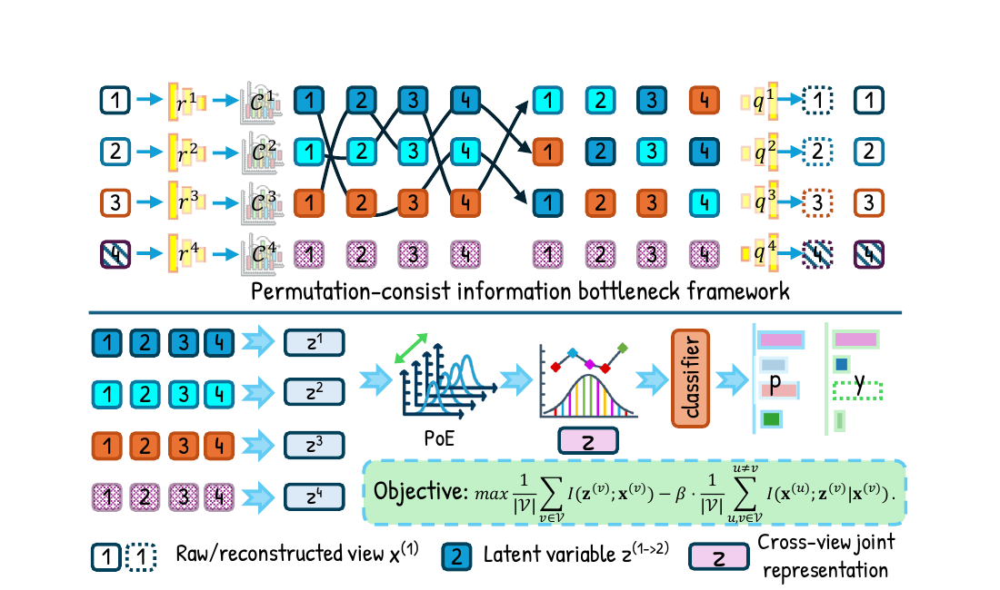

<div align="center">

# PCVE

### Permutation-Consistent Variational Encoding for Incomplete Multi-View Multi-Label Classification

[](https://openreview.net/forum?id=y4LyiOIOUn)
[](https://www.python.org/)
[](https://pytorch.org/)
[](LICENSE)

Official PyTorch implementation of **PCVE**, published at **ICLR 2026**.

[[Paper]](https://openreview.net/forum?id=y4LyiOIOUn) · [[Code]](https://github.com/justsmart/PCVE)

</div>

---

PCVE tackles **incomplete multi-view multi-label classification (iM3C)**, where both input views and label annotations can be missing. It learns compact, task-relevant representations through an information-bottleneck formulation and aligns cross-view latent distributions with permutation-consistent regularization.

<p align="center">
  
</p>

## Highlights

- **Permutation-consistent variational encoding** aligns latent variables that represent the same target semantics across different views.
- **Information-bottleneck learning** balances cross-view semantic consistency and view-specific information preservation.
- **Product-of-Experts fusion** supports arbitrary observed-view subsets without explicitly imputing missing inputs.
- **Masked multi-label supervision** learns only from available label annotations.
- Evaluated on five standard six-view benchmarks under both incomplete and fully observed settings.

## Results

Results reported in the paper with **50% missing views**, **50% missing labels**, and a **70%/15%/15%** train/validation/test split. Higher is better for every metric shown below.

| Dataset | AP | 1-HL | 1-RL | AUC | 1-OE | 1-Cov |
|:--|--:|--:|--:|--:|--:|--:|
| Corel5k | 0.421 | 0.988 | 0.910 | 0.913 | 0.493 | 0.790 |
| Pascal07 | 0.559 | 0.934 | 0.834 | 0.857 | 0.471 | 0.790 |
| ESPGame | 0.314 | 0.983 | 0.852 | 0.856 | 0.460 | 0.634 |
| IAPRTC12 | 0.336 | 0.981 | 0.888 | 0.889 | 0.477 | 0.680 |
| MIRFLICKR | 0.618 | 0.895 | 0.880 | 0.868 | 0.670 | 0.682 |

Mean and standard-deviation records produced by the released code are stored in [`final_records/`](final_records/).

## Installation

```bash
git clone git@github.com:justsmart/PCVE.git
cd PCVE

python -m venv .venv
source .venv/bin/activate
pip install -r requirements.txt
```

The experiments in the paper use PyTorch 2.x and a single NVIDIA GPU. The code also selects CPU automatically when CUDA is unavailable, although GPU training is recommended.

## Data preparation

The datasets are not redistributed in this repository. Prepare the six-view features and incomplete-data folds as MATLAB files using this layout:

```text
data/
└── corel5k/
    ├── corel5k_six_view.mat
    └── corel5k_six_view_MaskRatios_0.5_LabelMaskRatio_0.5_TraindataRatio_0.7.mat
```

The feature file must contain:

- `X`: a MATLAB cell array containing the six feature views;
- `label`: the multi-label matrix in `{0, 1}` or `{-1, 1}`.

The fold file must contain:

- `folds_data`: observed-view indicators;
- `folds_label`: observed-label indicators;
- `folds_sample_index`: one-based sample indices for each fold.

Supported benchmark names in the paper are `corel5k`, `pascal07`, `espgame`, `iaprtc12`, and `mirflickr`.

## Training and evaluation

Run one dataset with the paper's default setting:

```bash
python train_new.py \
  --dataset corel5k \
  --root-dir ./data \
  --mask-view-ratio 0.5 \
  --mask-label-ratio 0.5 \
  --training-sample-ratio 0.7 \
  --folds-num 10 \
  --epochs 150
```

Run several datasets sequentially:

```bash
python train_new.py \
  --datasets corel5k espgame iaprtc12 \
  --root-dir ./data
```

Useful options:

| Option | Default | Description |
|:--|:--:|:--|
| `--z_dim` | `512` | Latent representation dimension |
| `--batch_size` | `128` | Mini-batch size |
| `--lr` | `0.001` | Initial SGD learning rate |
| `--momentum` | `0.9` | SGD momentum |
| `--alpha` | `1.0` | Reconstruction-loss weight |
| `--beta` | `1.0` | Permutation-consistency weight |
| `--gamma` | `0.1` | Inter-view contrastive-loss weight |
| `--sigma` | `0.1` | Intra-view consistency-loss weight |
| `--save-curve` | off | Save validation AP and training-loss curves |
| `--logs` | off | Write per-run log files |

Training automatically evaluates on the validation split, selects the best epoch using AP, 1-RL, and AUC, and reports final results on the test split.

## Repository structure

```text
PCVE/
├── MLdataset.py       # MATLAB loading, masks, folds, and data loaders
├── VAE.py             # Reusable variational encoder building blocks
├── model_VAE_new.py   # Cross-view variational encoders and PoE fusion
├── model_new.py       # PCVE model and multi-label classifier
├── myloss_new.py      # Losses used by the training objective
├── train_new.py       # Training, validation, and evaluation entry point
├── evaluation.py      # Multi-label evaluation metrics
├── utils.py           # Logging and metric aggregation
└── final_records/     # Released experiment records
```

## License

This project is released under the [MIT License](LICENSE).

## Citation

If this code is helpful to your research, please cite our paper:

```bibtex
@inproceedings{liu2026permutationconsistent,
  title     = {Permutation-Consistent Variational Encoding for Incomplete Multi-View Multi-Label Classification},
  author    = {Chengliang Liu and Bo Li and Bob Zhang and Xiaoling Luo and Yabo Liu and Jie Wen},
  booktitle = {The Fourteenth International Conference on Learning Representations},
  year      = {2026},
}
```
